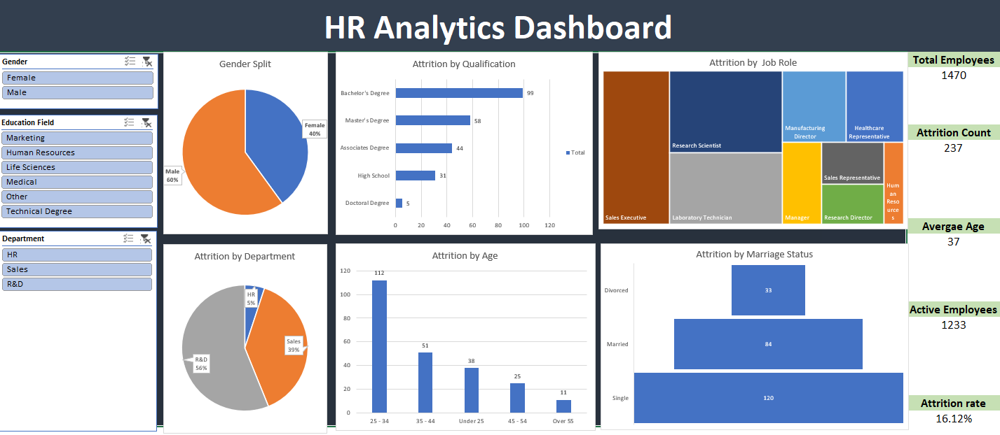

# HR Analytics Dashboard — Excel

An interactive HR analytics dashboard built in Microsoft Excel to understand employee attrition and workforce patterns across different employee segments.

## Dashboard Preview

## Project Overview

This dashboard provides a quick view of employee demographics, attrition, and workforce characteristics.

It uses PivotTables, PivotCharts, and slicers to make the analysis interactive and allow users to explore employee attrition across different dimensions.

## Key Metrics

- Total Employees: 1,470
- Attrition Count: 237
- Active Employees: 1,233
- Average Age: 37
- Attrition Rate: 16.12%

## Analysis Covered

- Gender distribution
- Attrition by qualification
- Attrition by job role
- Attrition by department
- Attrition by age group
- Attrition by marital status
- Employee filtering by gender, education field, and department

## Key Insights

- R&D has the highest share of employee attrition among the three departments.
- Employees aged 25–34 account for the highest attrition count.
- Single employees show higher attrition compared with married and divorced employees.
- Bachelor's degree holders have the highest attrition count among the qualification groups.
- Sales Executive is one of the largest job-role segments by attrition.

## Tools Used

- Microsoft Excel
- PivotTables
- PivotCharts
- Slicers
- Data Analysis
- Dashboard Design

## How to Use

1. Download the Excel workbook.
2. Open the `Dashboard` sheet in Microsoft Excel.
3. Use the slicers to filter the analysis by gender, education field, and department.
4. Explore the charts and KPIs to understand employee attrition patterns.

## Files

- `HR Analytics Dashboard.xlsx` — Interactive Excel dashboard
- `Screenshots/` — Dashboard preview and supporting screenshots

## Author

Neil
